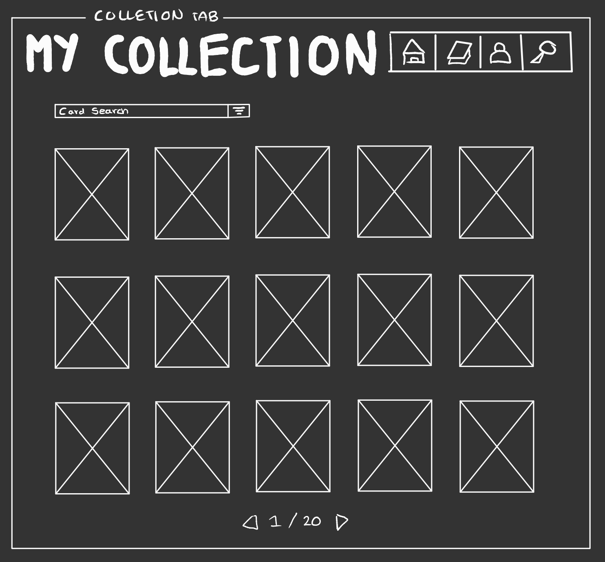
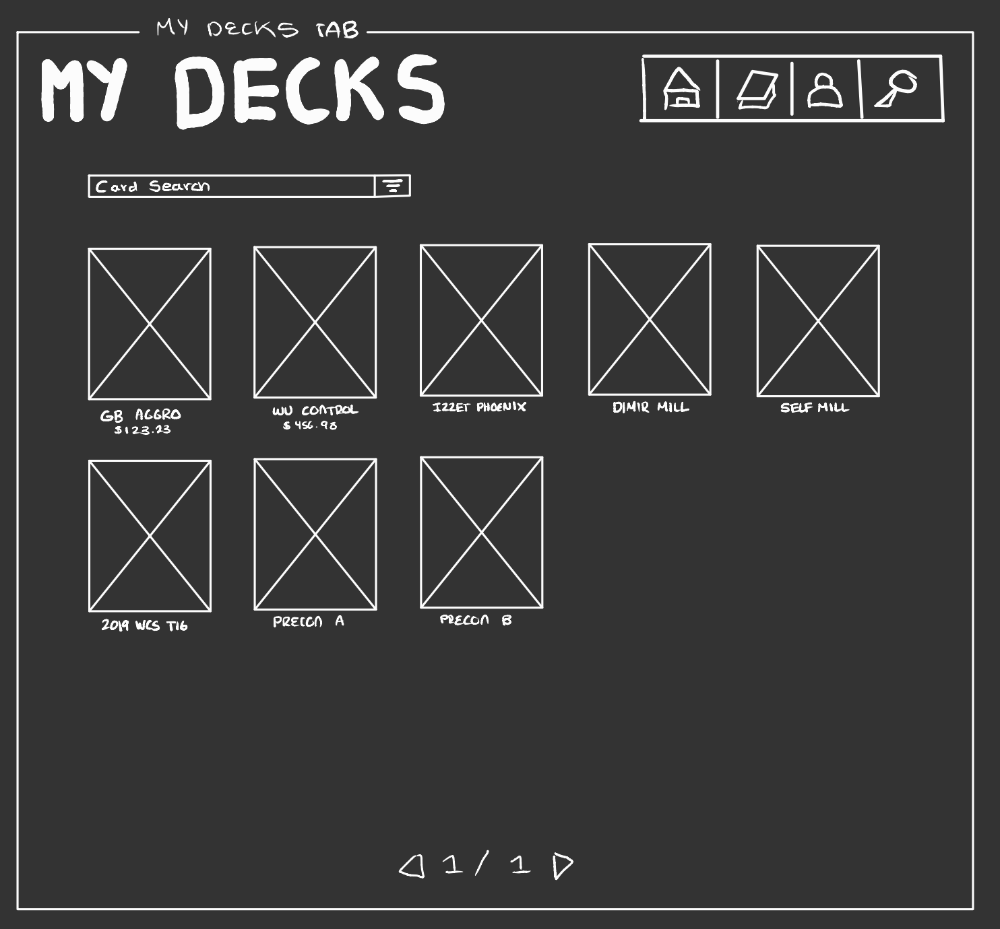
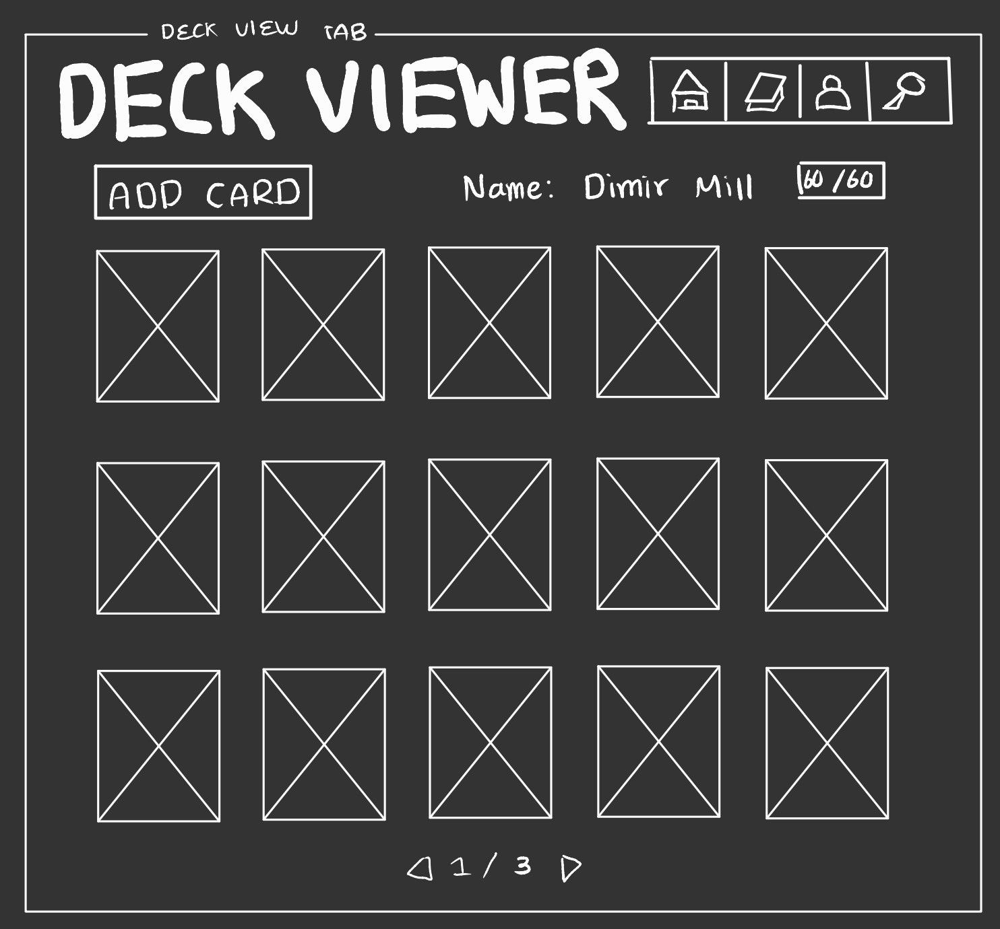
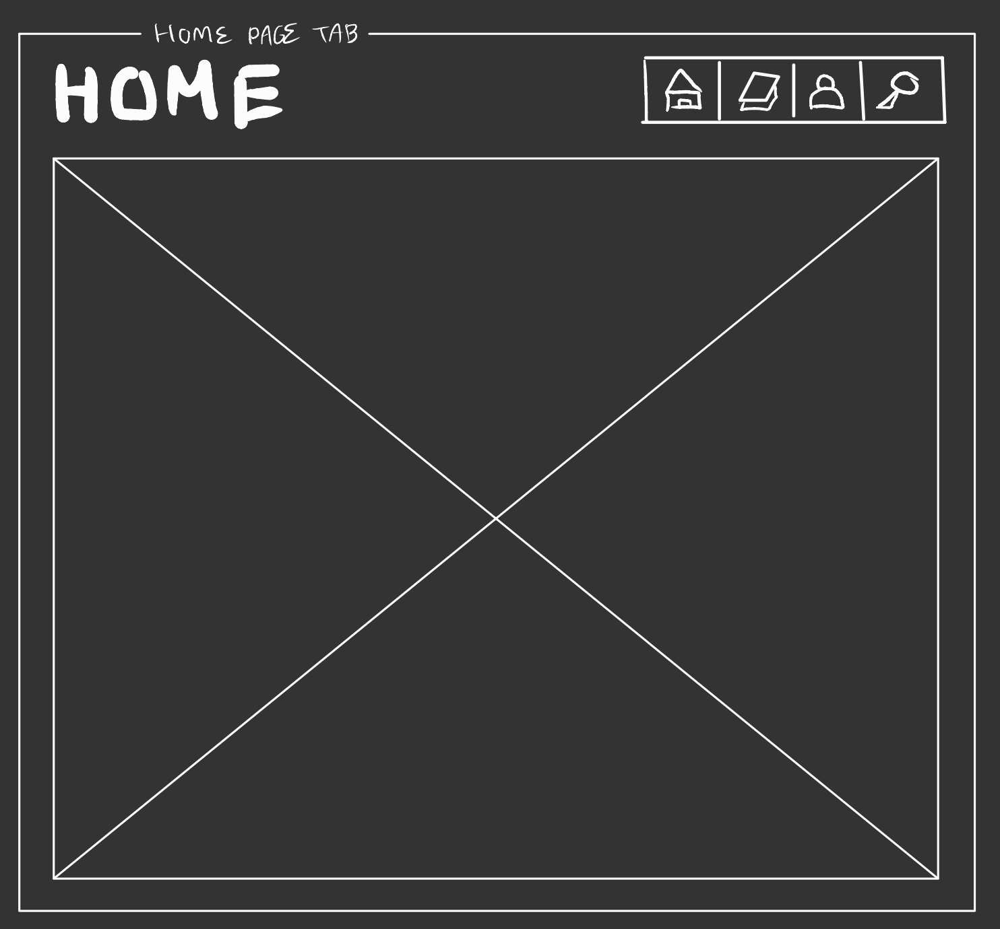
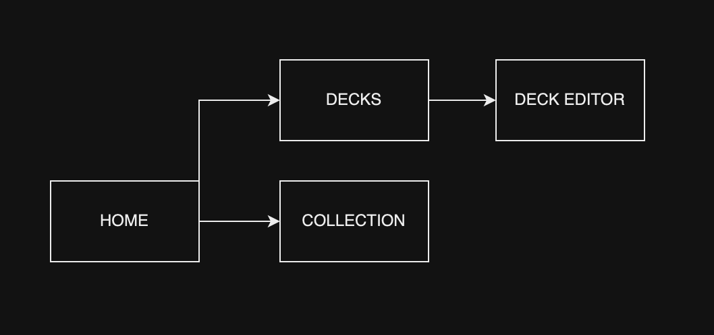

# Lightweight Deck Builder and Collection Tracker for Magic the Gathering (better name TBD)

## Overview

Magic the Gathering (MtG) has proven itself to be the most popular deck-building card game of all time, with over fifty million players in 2023 and a history spanning back to 1993. However, with that many players and that much time, there are over 27,000 (and increasing!) unique MtG cards. With that many cards, it can become difficult to keep track of all possible decks as well as the contents of one's personal card collection needed to craft them. Moreover, if one needs a card for their deck that they do not have in their collection, they might need to trade for or buy the card in a way where readily knowing the market price for it is incredily useful. This app combines two solutions to these two problems in one lightweight, simple package. Manage your collection, build decks, and keep track of card prices all from the web!

## Data Model

The application will store Users, their Collections, and their Decks.

* Users can have a multiple decks made using cards from their collection.
* Each deck is composed of 60 cards, with a maximum of 4 copies of any single card per deck.
* Decks must adhere to the current banned and restricted cards list put out by MtG.
* A user's collection can contain any amount of existing cards.

An Example Card:

```javascript
{
  name: // name of the card,
  manaCost: [/*colorless cost */,  // cards in MtG can be cast using mana of 5 different colors plus colorless
             /*red cost */, 
             /*green cost */, 
             /*blue cost*/, 
             /*black cost*/, 
             /*white cost*/]
  format: // formats in which the card is legal: "standard" "vintage" "all"
  printing: // many cards have been reprinted, this specifices which version of the card one has.
}
```

An Example Deck:

```javascript
{
  name: // player's chosen deck name
  format: // available formats: "standard" "vintage"
  cards: [
    { name: "Black Lotus", manaCost: [0,0,0,0,0,0], formats: "vintage", printing: "ALPHA"},
    // ... 58 more cards ...
    { name: "Arclight Phoenix", manaCost: [5,1,0,0,0,0], formats: "vintage", printing: "GRN"},
  ],
  createdAt: // timestamp,
  price: // cost to assemble deck IRL if one were to buy each card at market price.
}
```

An Example User:

```javascript
{
  username: "unbanJace123",
  hash: // a password hash,
  collection: // an array of card objects,
  decks: // an array of deck objects
}
```

## [See the Schemas](db.mjs) 

## Wireframes

/collection - page for viewing and modifying card collection



/decks - page for showing the user's decks



/deckviewer - page for showing and modifying a user's deck



/ - home page for app



## Site map


(A Nav Bar present in each page optionally connects every page to each other)

## User Stories

1. as non-registered user, I can register a new account with the site
2. as a user, I can log in to the site
3. as a user, I can add and remove cards from my collection
4. as a user, I can use cards from my collection to build a deck
5. as a user, I can view the price of my deck and of individual cards at market price
6. as a user, I can filter by my decks that fit a specific format
7. as a user, I can filter my collection based on a specific format
8. as a user, I can check my deck to make sure it is legal in a given format
9. (tenative) as a user, I can share a deck with another user.

## Research Topics

* (5 points) Integrate user authentication
    * I'm going to be using passport for user authentication
    * And account has been made for testing; I'll email you the password
    * First time working with authentication, weighted accordingly
* (3 points) Work with Scryfall, TCGPlayer, and MtG API's
    * Card data sourced from ScryFall (popular MtG website with public database) API 
    * Card prices sourced from TCGPlayer (largest trading card market) API
    * Card legality and miscelaneous data sourced from MtG API
    * May need more depending on final product
    * May need to change Scryfall API depending on how many calls the app needs to make
* (1 point) Share deck with other users
    * One user can send a deck to another user, that other user then has a chance to accept the deck
      and add it to their own decks (but not their collection)
* (4 points) vue.js
    * used vue.js as the frontend framework; it's a challenging library to learn, so I've assigned it 4 points

(10) points total out of (8) required points

## [See Main Project File](app.mjs) 

## Annotations / References Used

1. [Scryfall API](https://scryfall.com/docs/api)
2. [TCGPlayer API](https://docs.tcgplayer.com/docs/welcome)
3. [MtG API](https://docs.magicthegathering.io/)

